# Deploying Cisco CloudCenter Application Profiles with the REST API

This Deploying Cisco CloudCenter Application Profiles with the REST API Learning Lab will guide you through the use of Cisco CloudCenter REST APIs to deploy a CloudCenter Application Profile for a UCS Managed Blade and the deployment of a Splunk Application Profile.

## Objectives

After completing this lab you will know:

  - How to use Cisco CloudCenter to Generate CloudCenter REST API JSON
  - How to submit a Cisco CloudCenter Application Profile Deployment Job
  - How to check the Status of a Cisco CloudCenter Application Profile Deployment Job

## Prerequisites
Prior to starting this learning lab, it would be helpful to understand Cisco CloudCenter functionality.

An understanding of REST, JSON and the linux command line utilities `curl` and `vi` would also be helpful.

## Cisco CloudCenter Download and Documentation
Documentation for Cisco CloudCenter REST API is available at  [docs.cloudcenter.cisco.com](https://docs.cloudcenter.cisco.com/display/40API/CloudCenter+API+Overview).

You can also [download](https://software.cisco.com/download/home/286308292/type/286309561/release/4.9%25281%2529) and install Cisco CloudCenter.

### Learning Lab Infrastructure Requirements
All the exercises in the Introduction to the Cisco CloudCenter REST API Learning Lab can be completed using [Cisco dCloud](https://dcloud.cisco.com). Use the "Catalog" to search for **Cisco CloudCenter 4.8 with ACI 2.2 v1**.

The **Cisco CloudCenter 4.8 with ACI 2.2 v1** dCloud environment is available in every dCloud region.

# Step 1: Deploy a UCS Bare Metal Server Application Profile

### *Almost* Deploy the Bare Metal Server Application Profile
1. Launch the CloudCenter UI

  - ***Click*** the CloudCenter Shortcut on the Desktop

    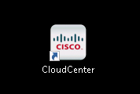<br/><br>

2. Login as

  - EMAIL: `demouser@dcloud.cisco.com`
  - PASSWORD: `C1sco12345`
  - TENANT ID: **No TENANT ID** is required

    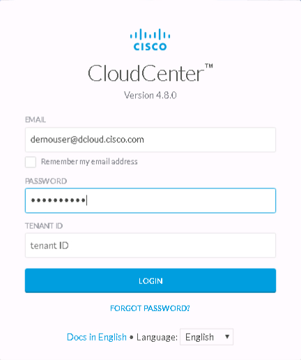<br/><br>

3. Navigate to **App Profiles** Menu

  - ***Click*** App Profiles

    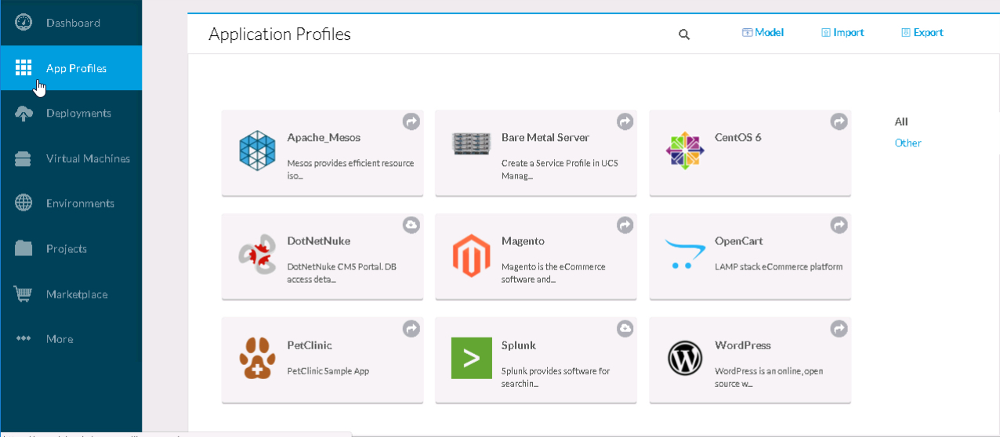<br/><br>

4. ***Almost*** Deploy Application Profile "Bare Metal Server"

  - ***Hover*** over "Bare Metal Server" Application Profile
  - ***Click*** the "More Actions" *drop-down* in the lower-right corner.

    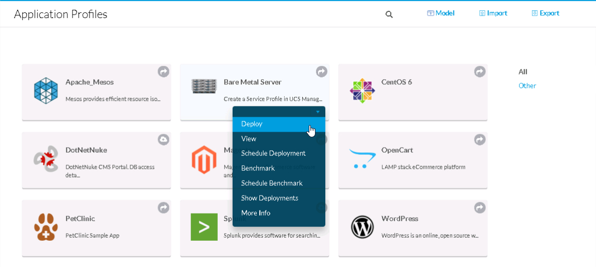<br/><br>

5. Enter a "DEPLOYMENT NAME" in the "General Settings" section

  - ***Enter*** **LL_BMS** in the "DEPLOYMENT NAME" field (*Learning Labs Bare Metal Server*)

    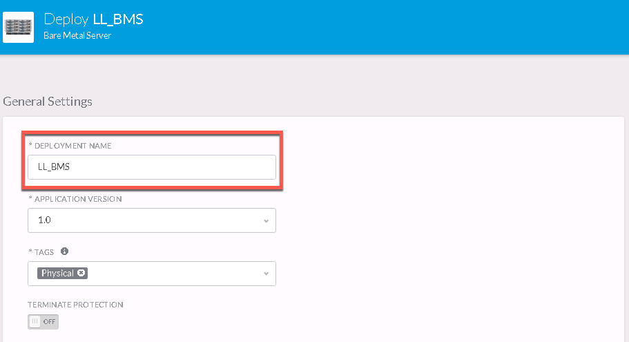<br/><br>

6. Enter a "SERVICEPROFILENAME" in the "Tier Settings" section

  - ***Scroll*** down to the "Tier Settings" section
  - ***Enter*** **LL_BMS_SP** in the "DEPLOYMENT NAME" field (*Learning Labs Bare Metal Server Service Profile*)

    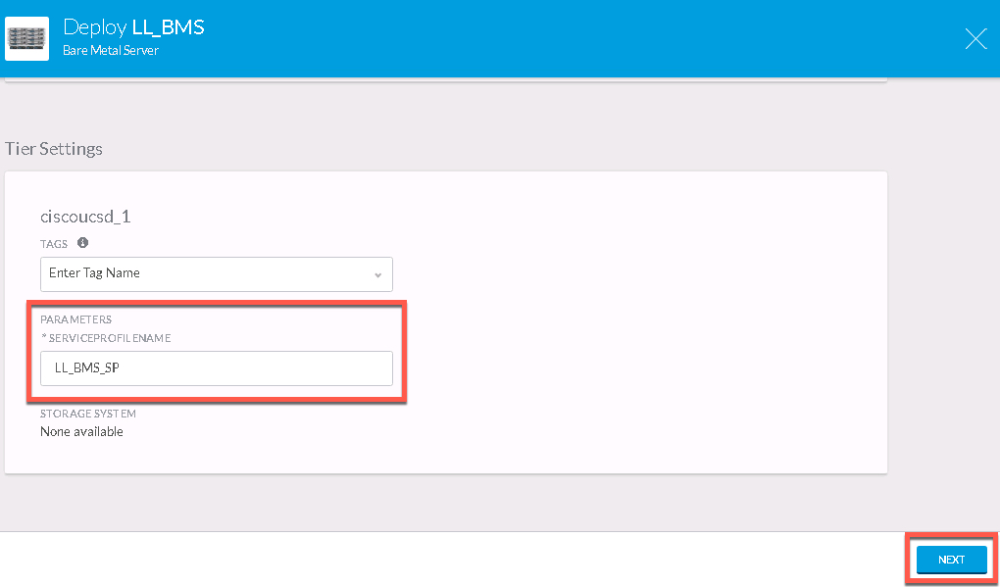<br/><br

7. Go to the next page of the Application Profile

  - ***Click*** the "NEXT" button in the lower-right corner.

### Deploy the Bare Metal Server Application Profile

1. Copy the "RESTFUL JSON" for the Application Profile deployment.

  - ***Click*** the "RESTFUL JSON" button in the lower-right.

    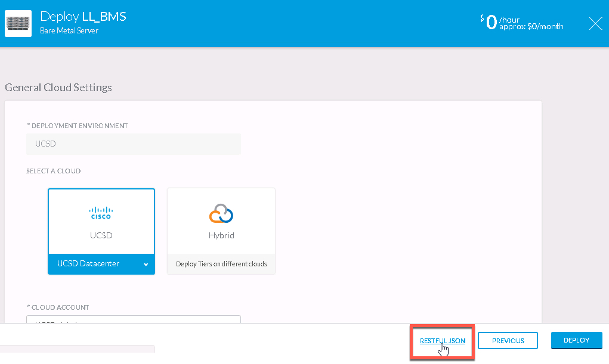<br/><br>

2. Select and Copy all the JSON in the "RESTFUL JSON" pop-up dialog box.

  - Be sure to just copy what is between the left-most upper and lower curly braces **{ }**

    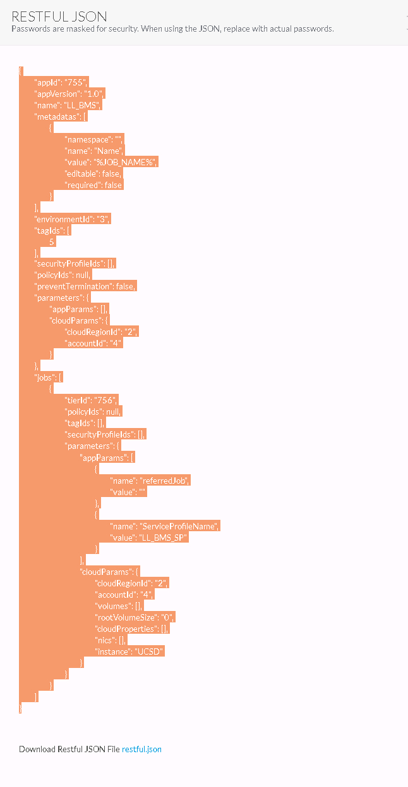<br/><br>

3. Use `vi` to create a file called `bare_metal_server_job.json.`

    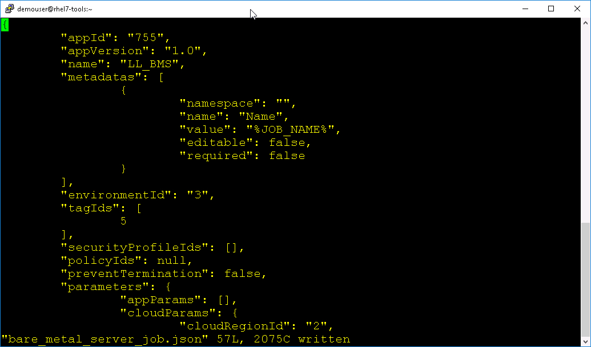<br/><br>

4. **Do Not** complete the Application Profile deployment operation.

  - ***Click*** the **X** in the upper-right corner to cancel the Application Profile deployment operation.

  - ***Click*** the "YES" button on the "Cancel New Deployment" dialog box.

    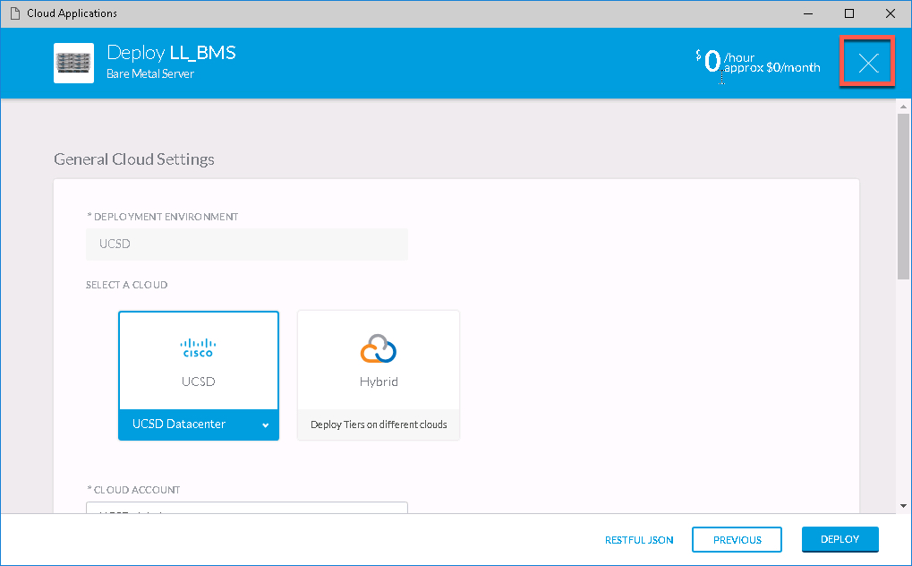<br/><br>
    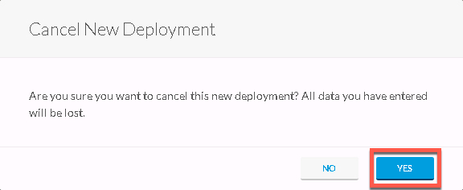<br/><br>

5. Use `curl` to deploy the Application Profiles

  ```
  curl -s -k -X POST -D response_headers.txt -H "Accept: application/json" -H "Content-Type: application/json" -u demouser_4:1525A9C15F6520C0 https://ccm.dcloud.cisco.com/v2/jobs -d @bare_metal_server_job.json | python -m json.tool
  ```

  Notice that the Application Profile deployment HTTP method is `POST`, also the API version indicated in the URL is Version 2.

  Cisco CloudCenter REST API calls can be either Version 1 or Version 2. If an API in Version 2 is similar to one in Version 1, the Version 2 typically replaces Version 1.

  A significant amount of JSON is returned (shown below). At the very end of the returned JSON there is a URL that can be used to check the status of the job.

  "resource": "https://ccm.dcloud.cisco.com/v2/jobs/360"

    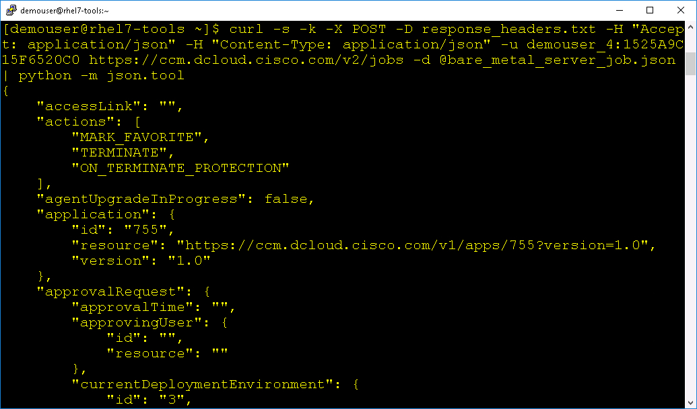<br/><br>

6. Use `curl` to check the status of the job.

  ```
  curl -s -k -X GET -D response_headers.txt -H "Accept: application/json" -H "Content-Type: application/json" -u demouser_4:1525A9C15F6520C0 https://ccm.dcloud.cisco.com/v2/jobs/360 | python -m json.tool
  ```

    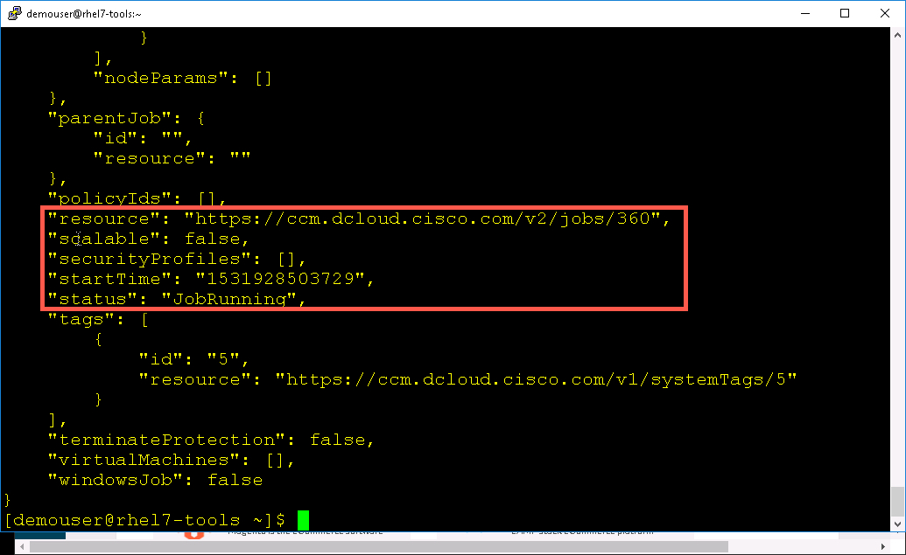<br/><br>

  Results from running `bare_metal_server_job.json`
  ```JSON
  {
      "accessLink": "",
      "actions": [
          "MARK_FAVORITE",
          "TERMINATE",
          "ON_TERMINATE_PROTECTION"
      ],
      "agentUpgradeInProgress": false,
      "application": {
          "id": "755",
          "resource": "https://ccm.dcloud.cisco.com/v1/apps/755?version=1.0",
          "version": "1.0"
      },
      "approvalRequest": {
          "approvalTime": "",
          "approvingUser": {
              "id": "",
              "resource": ""
          },
          "currentDeploymentEnvironment": {
              "id": "3",
              "resource": "https://ccm.dcloud.cisco.com/v1/environments/3"
          },
          "fromDeploymentEnvironment": {
              "id": "",
              "resource": ""
          },
          "initiatingUser": {
              "id": "4",
              "resource": "https://ccm.dcloud.cisco.com/v1/users/4"
          },
          "message": "",
          "requestTime": "",
          "status": "AUTO_APPROVED"
      },
      "bareMetalMachines": [],
      "benchmark": false,
      "childJobs": [
          {
              "dependencies": [],
              "id": "361",
              "resource": "https://ccm.dcloud.cisco.com/v2/jobs/361"
          }
      ],
      "cloudFamily": "CiscoUCSD",
      "customActions": [],
      "deploymentEntity": {
          "attributes": {
              "containsExternalServices": false,
              "health": "No Status",
              "ownerId": "4",
              "status": "Submitted"
          },
          "id": "360",
          "name": "LL_BMS",
          "type": "DEPLOYMENT"
      },
      "deploymentEnvironment": {
          "id": "3",
          "resource": "https://ccm.dcloud.cisco.com/v1/environments/3"
      },
      "description": "",
      "endTime": "",
      "favorite": false,
      "favoriteCreationTime": "",
      "hidden": false,
      "id": "360",
      "jobStatusMessage": "",
      "lastUpdatedTime": "1531928498304",
      "metadata": [
          {
              "editable": false,
              "name": "Physical",
              "namespace": "",
              "required": false,
              "value": "USER_DEFINED_TAG"
          },
          {
              "editable": false,
              "name": "Name",
              "namespace": "",
              "required": false,
              "value": "%JOB_NAME%"
          }
      ],
      "name": "LL_BMS",
      "owner": true,
      "ownerEmailAddress": "demouser@dcloud.cisco.com",
      "parameters": {
          "appParams": [
              {
                  "name": "appPackage",
                  "value": ""
              },
              {
                  "name": "cliqrWebappAccessLink",
                  "value": ""
              },
              {
                  "name": "cliqrForceHttpRedirect",
                  "value": "0"
              },
              {
                  "name": "SharedStorageMount",
                  "value": "/shared"
              },
              {
                  "name": "SharedStorageName",
                  "value": "mystor"
              },
              {
                  "name": "OSSVC_HOME",
                  "value": "/usr/local/osmosix/service"
              },
              {
                  "name": "cliqrExternalHttpEnabled",
                  "value": "1"
              },
              {
                  "name": "cliqrUseCustomCert",
                  "value": "0"
              },
              {
                  "name": "cliqrSSLCert",
                  "value": ""
              },
              {
                  "name": "cliqrAppTierName",
                  "value": "Bare Metal Server"
              },
              {
                  "name": "launchVendorId",
                  "value": "1"
              },
              {
                  "name": "cliqrAppType",
                  "value": "n-tier"
              },
              {
                  "name": "cliqrSSLKey",
                  "value": ""
              },
              {
                  "name": "cliqrExternalNoProtocolEnabled",
                  "value": "0"
              },
              {
                  "name": "cliqrExternalHttpsEnabled",
                  "value": "0"
              },
              {
                  "name": "launchUserName",
                  "value": "demouser_4"
              },
              {
                  "name": "microSegmentation",
                  "value": "0"
              },
              {
                  "name": "cliqrAppName",
                  "value": "Bare Metal Server"
              },
              {
                  "name": "pathParamNames_app_755_order_0",
                  "value": "appPackage"
              },
              {
                  "name": "CliqrDepEnvName",
                  "value": "UCSD"
              },
              {
                  "name": "bareMetalMachine",
                  "value": "false"
              },
              {
                  "name": "launchUserId",
                  "value": "4"
              },
              {
                  "name": "CliqrDepEnvId",
                  "value": "3"
              },
              {
                  "name": "cliqrNonStandardPort",
                  "value": ""
              },
              {
                  "name": "useNonStandardPort",
                  "value": "0"
              },
              {
                  "name": "launchIdent",
                  "value": "{user}demouser_4{group}End Users Group{vendor}1"
              },
              {
                  "name": "NumNodes",
                  "value": "1"
              }
          ],
          "cloudParams": {
              "accountId": "4",
              "autoCloudAndInstanceSelection": false,
              "cloudProperties": [
                  {
                      "name": "cloud",
                      "value": "UCSD-datacenter"
                  },
                  {
                      "name": "numNICs",
                      "value": "1"
                  }
              ],
              "cloudRegionId": 2,
              "deploymentIsolationTag": "",
              "instance": "",
              "instanceName": "",
              "networkTypeName": "",
              "nics": [],
              "provisionBareMetal": false,
              "rootVolumeSize": "",
              "selectionCriteria": "NONE",
              "storage": "",
              "volumes": []
          },
          "envParams": [
              {
                  "name": "appPackage",
                  "value": ""
              },
              {
                  "name": "cliqrWebappAccessLink",
                  "value": ""
              },
              {
                  "name": "cliqrForceHttpRedirect",
                  "value": "0"
              },
              {
                  "name": "JOB_ID",
                  "value": "360"
              },
              {
                  "name": "SharedStorageMount",
                  "value": "/shared"
              },
              {
                  "name": "SharedStorageName",
                  "value": "mystor"
              },
              {
                  "name": "OSSVC_HOME",
                  "value": "/usr/local/osmosix/service"
              },
              {
                  "name": "cliqrExternalHttpEnabled",
                  "value": "1"
              },
              {
                  "name": "cliqrUseCustomCert",
                  "value": "0"
              },
              {
                  "name": "cliqrSSLCert",
                  "value": ""
              },
              {
                  "name": "cliqrAppTierName",
                  "value": "Bare Metal Server"
              },
              {
                  "name": "launchVendorId",
                  "value": "1"
              },
              {
                  "name": "cliqrAppType",
                  "value": "n-tier"
              },
              {
                  "name": "cliqrSSLKey",
                  "value": ""
              },
              {
                  "name": "cliqrExternalNoProtocolEnabled",
                  "value": "0"
              },
              {
                  "name": "cliqrExternalHttpsEnabled",
                  "value": "0"
              },
              {
                  "name": "launchUserName",
                  "value": "demouser_4"
              },
              {
                  "name": "microSegmentation",
                  "value": "0"
              },
              {
                  "name": "cliqrAppName",
                  "value": "Bare Metal Server"
              },
              {
                  "name": "pathParamNames_app_755_order_0",
                  "value": "appPackage"
              },
              {
                  "name": "imageName",
                  "value": "Callout Workflow"
              },
              {
                  "name": "CliqrDepEnvName",
                  "value": "UCSD"
              },
              {
                  "name": "bareMetalMachine",
                  "value": "false"
              },
              {
                  "name": "launchUserId",
                  "value": "4"
              },
              {
                  "name": "CliqrDepEnvId",
                  "value": "3"
              },
              {
                  "name": "osName",
                  "value": "Linux"
              },
              {
                  "name": "cliqrNonStandardPort",
                  "value": ""
              },
              {
                  "name": "useNonStandardPort",
                  "value": "0"
              },
              {
                  "name": "launchIdent",
                  "value": "{user}demouser_4{group}End Users Group{vendor}1"
              },
              {
                  "name": "NumNodes",
                  "value": "1"
              }
          ],
          "nodeParams": []
      },
      "parentJob": {
          "id": "",
          "resource": ""
      },
      "policyIds": [],
      "resource": "https://ccm.dcloud.cisco.com/v2/jobs/360",
      "scalable": false,
      "securityProfiles": [],
      "startTime": "",
      "status": "JobSubmitted",
      "tags": [
          {
              "id": "5",
              "resource": "https://ccm.dcloud.cisco.com/v1/systemTags/5"
          }
      ],
      "terminateProtection": false,
      "virtualMachines": [],
      "windowsJob": false
  }
  ```
Next Step: Deploying a Splunk Application Profile.
