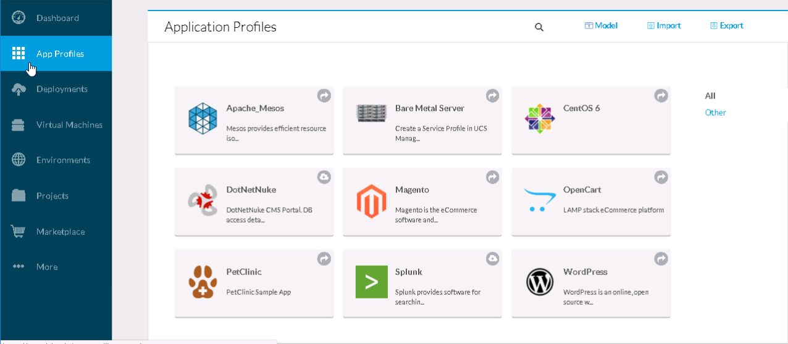

# Step 2: Deploy a Splunk Application Profile.

### *Almost* Deploy the Splunk Application Profile
1. Navigate to **App Profiles** Menu

  - ***Click*** App Profiles

    <br/><br>

2. ***Almost*** Deploy Application Profile "Splunk"

  - ***Hover*** over "Splunk" Application Profile
  - ***Click*** the "More Actions" *drop-down* in the lower-right corner.

    <br/><br>

3. Enter a "DEPLOYMENT NAME" in the "General Settings" section

  - ***Enter*** **LL_SPLUNK** in the "DEPLOYMENT NAME" field
  - ***Select*** "QA" from the "TAGS" *drop-down*
  - ***Click*** the "NEXT" button

    <br/><br>

### Deploy the Splunk Application Profile
1. Copy the "RESTFUL JSON" for the Application Profile deployment.

  - ***Click*** the "RESTFUL JSON" button in the lower-right.

    <br/><br>

2. Select and Copy all the JSON in the "RESTFUL JSON" pop-up dialog box.

  - Be sure to just copy what is between the left-most upper and lower curly braces **{ }**

    <br/><br>

3. Use `vi` to create a file called `splunk_job.json.`

    <br/><br>

4. **Do Not** complete the Splunk Application Profile deployment operation.

  - ***Click*** the **X** in the upper-right corner to cancel the Splunk Application Profile deployment operation.

  - ***Click*** the "YES" button on the "Cancel New Deployment" dialog box.

    <br/><br>

5. Use `curl` to deploy the Application Profiles

  ```
  curl -s -k -X POST -D response_headers.txt -H "Accept: application/json" -H "Content-Type: application/json" -u demouser_4:1525A9C15F6520C0 https://ccm.dcloud.cisco.com/v2/jobs -d @splunk_job.json | python -m json.tool
  ```

  Again a significant amount of JSON is returned. At the very end of the returned JSON there is a URL that can be used to check the status of the job.

  "resource": "https://ccm.dcloud.cisco.com/v2/jobs/362"

    <br/><br>

6. Use `curl` to check the status of the job.

  ```
  curl -s -k -X GET -D response_headers.txt -H "Accept: application/json" -H "Content-Type: application/json" -u demouser_4:1525A9C15F6520C0 https://ccm.dcloud.cisco.com/v2/jobs/362 | python -m json.tool
  ```

    <br/><br>

7. View your Splunk Deployment in Cisco CloudCenter

  - ***Click*** "Deployments"  in CloudCenter to view the **LL_SPLUNK** Splunk Deployment.

    <br/><br>

**Congratulations! You've Completed, Deploying Cisco CloudCenter Application Profiles with the REST API**
