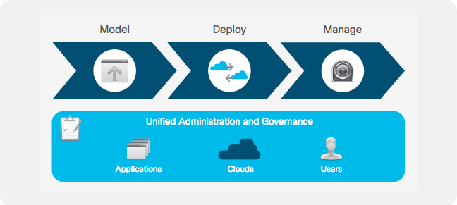
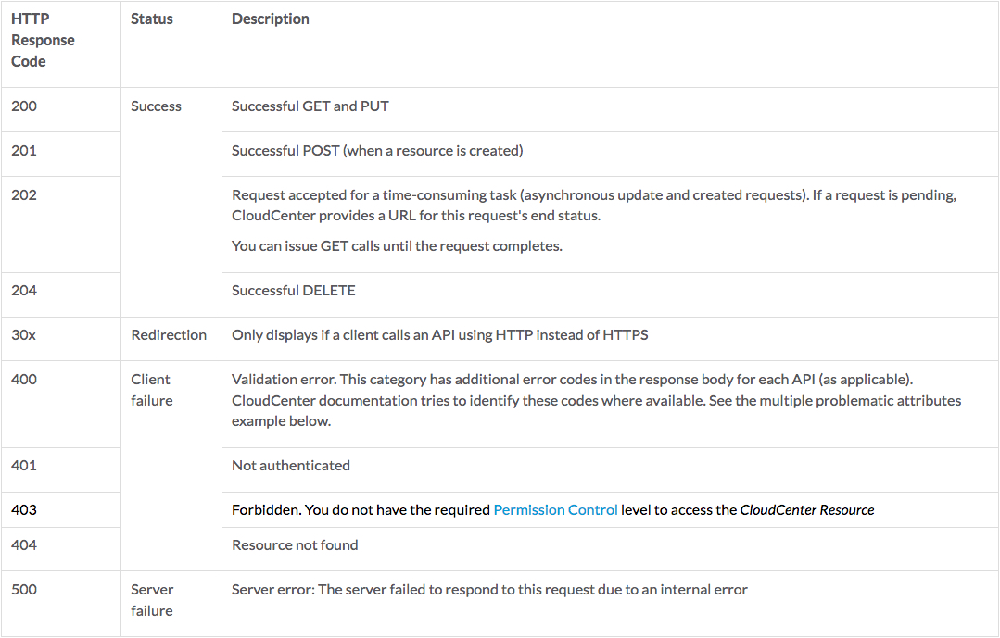

# Introduction to the Cisco CloudCenter REST API
This DevNet Learning Lab is an introduction to the Cisco CloudCenter REST API. The lab provides and overview of the REST API. A look at REST API Access Keys and the process of creating, updating and deleting a user via the REST API.

## Objectives
After completing this lab you will know:

  - How the Cisco CloudCenter REST API works.
  - What the Cisco CloudCenter REST API HTTP status codes represent.
  - How to Retrieve admin and user API Access Keys.
  - How to Create, Update and Delete users using the Cisco CloudCenter REST API.

## Prerequisites
Prior to starting this learning lab, it would be helpful to understand Cisco CloudCenter functionality.

An understanding of REST, JSON and the linux command line utilities `curl` and `vi` would also be helpful.

## Cisco CloudCenter Download and Documentation
Documentation for Cisco CloudCenter REST API is available at  [docs.cloudcenter.cisco.com](https://docs.cloudcenter.cisco.com/display/40API/CloudCenter+API+Overview).

You can also [download](https://software.cisco.com/download/home/286308292/type/286309561/release/4.9%25281%2529) and install Cisco CloudCenter.

### Learning Lab Infrastructure Requirements
All the exercises in the Introduction to the Cisco CloudCenter REST API Learning Lab can be completed using [Cisco dCloud](https://dcloud.cisco.com). Use the "Catalog" to search for **Cisco CloudCenter 4.8 with ACI 2.2 v1**.

The **Cisco CloudCenter 4.8 with ACI 2.2 v1** dCloud environment is available in every dCloud region.

### Cisco CloudCenter
Cisco CloudCenter is an application-centric hybrid cloud management platform that securely provisions infrastructure resources and deploys applications to data center, private cloud, and public cloud environments.

With Cisco CloudCenter breakthrough application-centric technology, users can;

  - **Model**: Quickly and easily build a cloud-independent application profile that defines the deployment and management requirements of an entire application stack.

  - **Deploy**: Use one click to deploy the application profile and related components and data to any data center or cloud environment.

  - **Manage**: Apply a wide range of application lifecycle actions to set policies to enable in-place scaling, support cross-environment bursting or high availability and disaster recovery, and stop the deployment.

    

# Step 1: Cisco CloudCenter REST API Overview
### CloudCenter API Version
CloudCenter API Version 1.0 (v1) provides APIs to support the following CloudCenter releases:

  - CloudCenter 4.x
  - CloudCenter 3.x

CloudCenter API Version 2.0 (v2) provides APIs to support the following CloudCenter releases:

  - CloudCenter 4.6.0 and later – identified for each API, where applicable.

### Who Can Use CloudCenter APIs?

Both CloudCenter admins and users can use CloudCenter REST APIs.

Your login credentials determine if you are an admin (platform (root), tenant admin, or co-admin) or a user. If you do not have the required Permission Control level to access any CloudCenter Resource, you receive the HTTP 403 status error shown below.

### HTTP Status Codes
CloudCenter APIs return one or more of the following HTTPS status codes for all (synchronous and asynchronous) API requests:

    

### HTTP Request Methods
CloudCenter APIs use HTTPS Version 1 to support the following request methods:

  - GET: To query or view the server information based on a CloudCenter deployment
  - PUT: To replace the entire object for update operations
  - POST: To perform a CloudCenter platform task or creating the resource
  - DELETE: To remove specific aspects of the CloudCenter deployment

### REST API Authentication
CloudCenter APIs require the following authentication details for each API call:

  - Username - this is not the login name, it is a username created by CloudCenter when the user is created.
  - API access key

### REST API Data Exchange Encoding
CloudCenter REST APIs accept JSON encoded data in the REST requests. The CloudCenter REST APIs can return JSON or XML and sometimes CSV depending upon the REST API call.

**Next Step**: Retrieving API Access Keys.
