# Step 2: Retrieving API Access Keys.
There is a CloudCenter REST API call to retrieve a user's API Access Key, however you first need your API Access Key to issue the REST API call.

A CloudCenter `admin` can use their API Access Key to programmatically retrieve other user's API Access Keys, so  once the `admin` user has their API Access Key all other API Access Keys can be retrieved and distributed programmatically.

### Retrieve API Access Keys for Admins and Users from the UI

1. Launch the CloudCenter UI

  - ***Click*** the CloudCenter Shortcut on the Desktop

    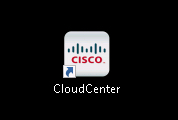<br/><br>

2. Login as

  - EMAIL: `admin@dcloud.cisco.com`
  - PASSWORD: `C1sco12345`
  - TENANT ID: **No TENANT ID** is required</br></br>

    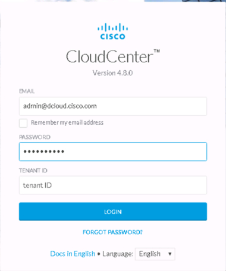<br/><br>

3. Navigate to **Admin --> Users** Menu

  - ***Click*** Admin
  - ***Click*** Users

    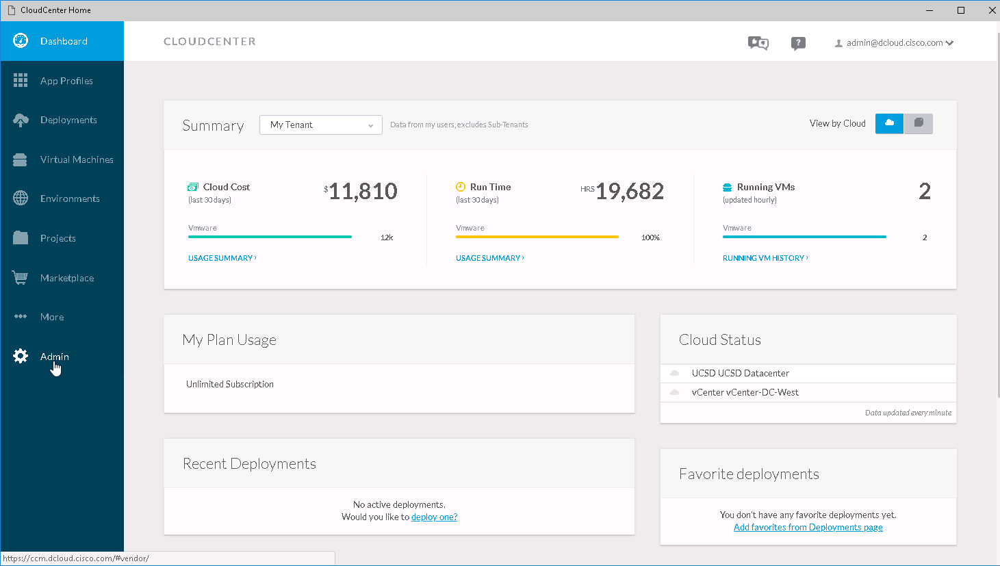<br/><br>
    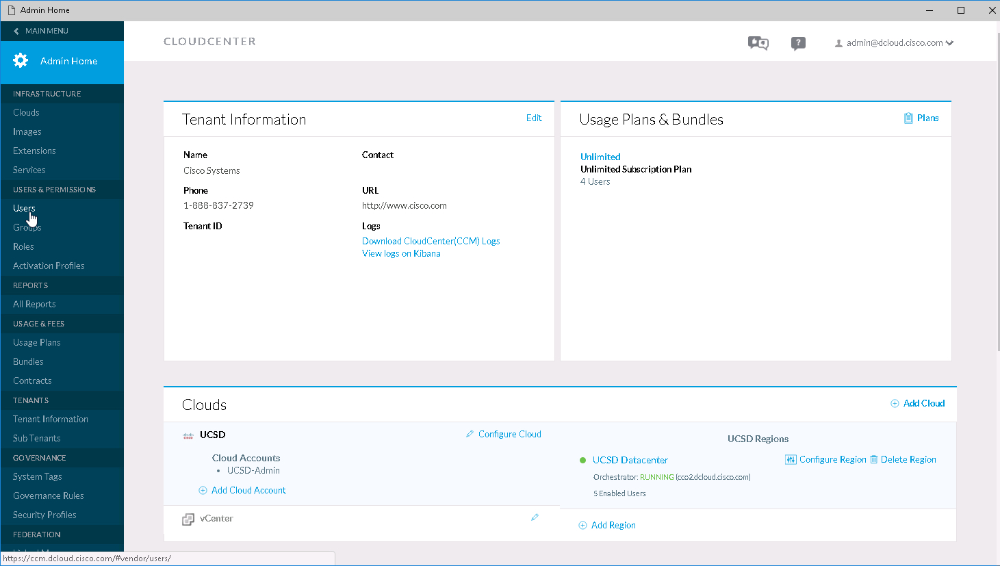<br/><br>

4. Retrieve the **API Key** and the **User Name** for the `dCloud Admin` and the `dCloud User`

  - ***Click*** Manage API Key for each of those users.

    Notice that for each User there is a `User Name` and a `Key`. The `User Name` is not the `Name` the the user was registered with, it is the first part of their email address suffixed with and underscore `_` and a CloudCenter generated sequence number.

  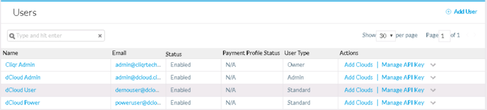<br/><br>
  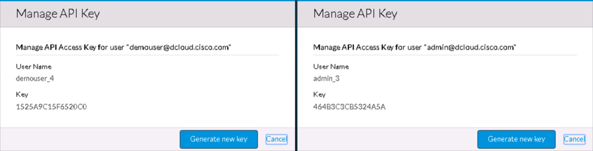<br/><br>

### Retrieve API Access Keys for Admins and Users from the API

Now that you have API Access Keys and User names for an Admin user and for a regular user you can use the CloudCenter REST API to retrieve API Access Keys.

These exercises are done on a linux system associated to the CloudCenter dCloud environment.

1. Open a session to the `Tools` linux server

  - ***Click*** the `Putty` shortcut on the taskbar
  - ***Double-Click*** the `Tools` entry in "Saved Sessions"
  - ***Username*** `demouser`
  - ***Password*** `C1sco12345`</br></br>

  <br/><br>
  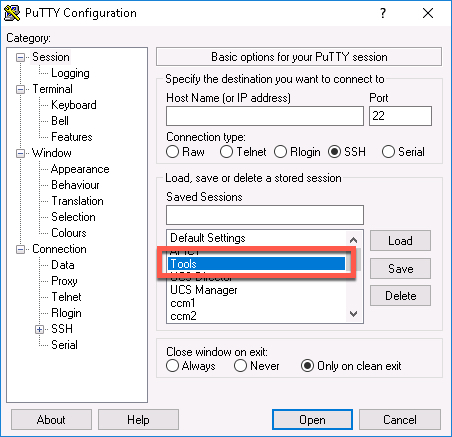<br/><br>
  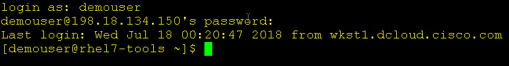<br/><br>

2. Use `curl` to view `admin` Keys

  ```
  curl -s -k -X GET -D response_headers.txt -H "Accept: application/json" -u admin_3:464B3C3CB5324A5A https://ccm.dcloud.cisco.com/v1/user/keys | python -m json.tool
  ```

  `curl` command explained
    - -s Silent
    - -k Ignore Certs
    - -X HTTP Method
    - -D response headers file name
    - -H Header(s)
    - -u username:password (digest auth)
    - Uri https://ccm.dcloud.cisco.com/v1/user/keys
    - Use `Python` to pretty print returned JSON

    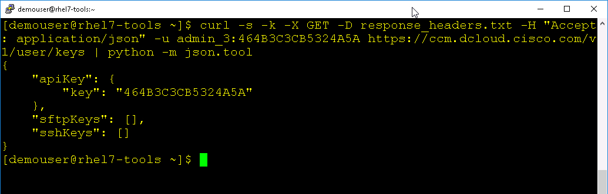<br/><br>    

3. Use `curl` to view `demouser` Keys URL

  ```
  curl -s -k -X GET -D response_headers.txt -H "Accept: application/json" -u demouser_4:1525A9C15F6520C0 https://ccm.dcloud.cisco.com/v1/users | python -m json.tool
  ```

  Locate in the output the URL for the `demouser`'s keys

  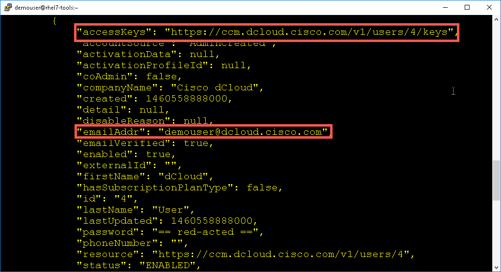<br/><br>

4. Use `curl` to view `demouser` Keys as `demouser`

  ```
  curl -s -k -X GET -D response_headers.txt -H "Accept: application/json" -u demouser_4:1525A9C15F6520C0 https://ccm.dcloud.cisco.com/v1/users/2/keys | python -m json.tool
  ```
  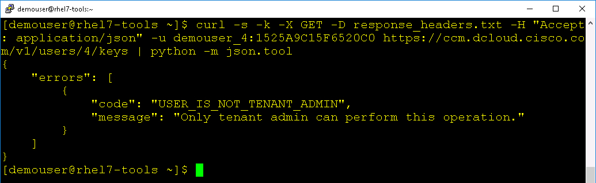<br/><br>

  You cannot retrieve your own keys, only the CloudCenter `admin` or the user's `tenant admin` can retrieve keys.</br></br>

5. Use `curl` to view `demouser` Keys as `admin`

  ```
  curl -s -k -X GET -D response_headers.txt -H "Accept: application/json" -u admin_3:464B3C3CB5324A5A https://ccm.dcloud.cisco.com/v1/users/4/keys | python -m json.tool
  ```

  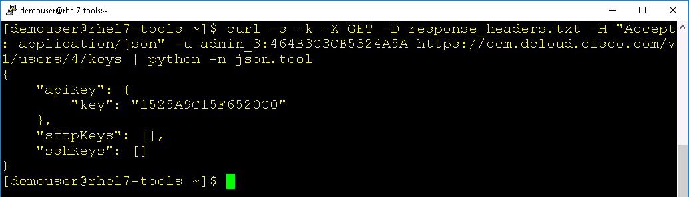<br/><br>

**Next Step**: Creating, Updating and Deleting a CloudCenter User.
