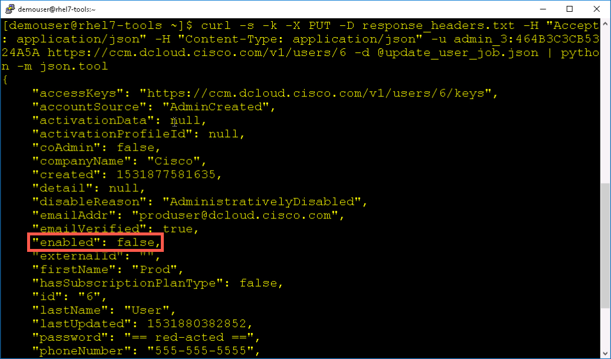

# Introduction to the Cisco CloudCenter REST API

# Step 3: Creating, Updating and Deleting a CloudCenter User.
Users are always being added, updated, disabled and deleted in software systems. Cisco CloudCenter is no different. The CloudCenter REST API provides methods for these operations.

Each time any of the `curl` commands are run you can view the contents of the `response_headers.txt` file to see the returned HTTP Status Codes. You can then check the returned HTTP Status codes against the HTTP Status Codes shown on *Page 1* of the lab.

### Create CloudCenter User
1. Create an **Activated** CloudCenter user named `peoduser` via the REST API.

  - Use `vi` to create a **JSON** formatted file called `user_create_activate_job.json`

  - Add this JSON to the file

  ```json
  {
    "firstName": "Prod",
    "lastName": "User",
    "password": "C1sco12345",
    "emailAddr": "produser@dcloud.cisco.com",
    "companyName": "Cisco",
    "phoneNumber": "",
    "externalId": "",
    "tenantId": 1,
    "activationData": {
      "activateRegions": [
        {
          "regionId": "1"
        },
        {
          "regionId": "2"
        }
      ],
      "agreeToContract": true,
      "sendActivationEmail": false,
      "importApps": []
    }
  }
  ```

  <br/><br>

2. Use `curl` to create the `produser` user

  ```
  curl -s -k -X POST -D response_headers.txt -H "Accept: application/json" -H "Content-Type: application/json" -u admin_3:464B3C3CB5324A5A https://ccm.dcloud.cisco.com/v1/users -d @user_create_activate_job.json | python -m json.tool
  ```
  <br/><br>

The `operationUrl` in the response can be used to check the status of the add user operation.

The `resourceUrl` in the response indicates the what resource location of the new user will be **once** the aadd process completes.

Notice that the HTTP method to create a user via the CloudCenter REST API is `POST`, prior to this all the query REST API operations with CloudCenter used `GET`

### Update CloudCenter User
1. Use `curl` and the `resourceUrl` from the add user operation to query for the just created user.

  - Try the `curl` command without the Python JSON pretty print and then with Python JSON pretty print.

  - Without Python JSON pretty print
  ```
  curl -s -k -X GET -D response_headers.txt -H "Accept: application/json" -u admin_3:464B3C3CB5324A5A https://ccm.dcloud.cisco.com/v1/users/6
  ```
  <br/><br>

  - With Python JSON pretty print
  ```
  curl -s -k -X GET -D response_headers.txt -H "Accept: application/json" -u admin_3:464B3C3CB5324A5A https://ccm.dcloud.cisco.com/v1/users/6 | python -m json.tool
  ```
  <br/><br>

2. Use the `curl` command with the Python JSON pretty print to save the output to a file named `update_user_job.json`
  ```
  curl -s -k -X GET -D response_headers.txt -H "Accept: application/json" -u admin_3:464B3C3CB5324A5A https://ccm.dcloud.cisco.com/v1/users/6 | python -m json.tool > update_user_job.json
  ```
  <br/><br>

3. Use `vi` to update the phoneNumber for `produser`

  - Set the `phoneNumber` attribute to `555-555-5555`
  <br/><br>

4. Use the `curl` command to send the user update.

  ```
  curl -s -k -X PUT -D response_headers.txt -H "Accept: application/json" -H "Content-Type: application/json" -u admin_3:464B3C3CB5324A5A https://ccm.dcloud.cisco.com/v1/users/6 -d @update_user_job.json | python -m json.tool
  ```
  <br/><br>

  The update user operation responds with the updated user object, showing that the `phoneNumber` attribute has been added/updated.

  Notice that the HTTP method to update a user via the CloudCenter REST API is `PUT`. `POST` creates objects in the CloudCenter REST API, `PUT` updates objects.

### Delete a CloudCenter User

1. Use the `curl` command to delete the `produser` users.

  ```
  curl -s -k -X DELETE -D response_headers.txt -H "Accept: application/json" -u admin_3:464B3C3CB5324A5A https://ccm.dcloud.cisco.com/v1/users/6
  ```
  <br/><br>

  `produser` cannot be deleted because it is an active user.

2. The user can only be deleted after the user has been disabled.
  - Use `vi` to disable the user by setting the `enabled` attribute to `false`.
  - The `enabled` attribute is a JSON boolean value, the current setting of `true` is not surrounded by quotes. Ensure that when changing the setting to `false` you **do not** surround it with quotes.

    <br/><br>

3. Use the `curl` command to send the user update.

  ```
  curl -s -k -X PUT -D response_headers.txt -H "Accept: application/json" -H "Content-Type: application/json" -u admin_3:464B3C3CB5324A5A https://ccm.dcloud.cisco.com/v1/users/6 -d @update_user_job.json | python -m json.tool
  ```
  <br/><br>

4.  Use the `curl` command to delete the `produser` users.

  ```
  curl -s -k -X DELETE -D response_headers.txt -H "Accept: application/json" -u admin_3:464B3C3CB5324A5A https://ccm.dcloud.cisco.com/v1/users/6
  ```

  - Use `more` to view the `response_headers.txt` file.

      <br/><br>

**Congratulations! You've Completed, Introduction to the Cisco CloudCenter REST API**
